# Self-Organization of Robots in a Hostile Environment

**Group:** 14  
**Date:** 16 March 2026  
**Members:** Deodato V. Bastos Neto, Karina Musina  

---

## 1. Overview and Objectives
This project is an Agent-Based Model (ABM) developed to simulate a distributed, multi-agent system where autonomous robots must cooperate to clean a hostile, radioactive environment. 

The environment is decomposed into three zones (from west to east): Z1 (low radioactivity), Z2 (medium radioactivity), and Z3 (high radioactivity). Three types of robots (Green, Yellow, Red) are restricted to specific zones and must collect, transform, and transport waste eastward to a final disposal zone.

**Complex Problem & Objectives:** The challenge is to orchestrate a multi-stage supply chain without centralized control. The objective is to evaluate whether our MAS architecture effectively and efficiently solves this problem.
**Criterion of Evaluation:** The relevance and satisfaction of our proposed behavioral models are evaluated using a strict trade-off metric: **Total Time to Clear (`time_to_clear`) vs. Communication/Energy Overhead (Number of messages exchanged and `cumulative_moves`)**.

---

## 2. Requirements & Running the Simulation

### Prerequisites
The project relies on Python 3+ and the Mesa framework with Solara for visualization.

    pip install mesa solara matplotlib pandas

### Execution
**1. Visual Mode (Web Interface):**
To launch the interactive SolaraViz dashboard, run:

    solara run server.py

**2. CLI Mode (Terminal):**
Run the simulation in the terminal and output step-by-step metrics:

    python run.py --steps 100 --n-waste 30 --verbose

Example with Green-to-Green coordination enabled (+ communication logs):

    python run.py --steps 100 --n-waste 30 --green-coordination --log-communications --verbose

**3. Automated Experiments (Batch Mode):**
To run the evaluation suite across multiple configurations and generate comparative performance graphs:

    ./run_batch.sh

---

## 3. Theoretical Framework & M&S Scope (Lecture 2)

Following the Modeling & Simulation (M&S) theory principles:
* **Source System:** A hazardous waste management facility requiring specialized, decentralized robotic handling due to high radiation destroying centralized communication arrays.
* **Experimental Frame:** We observe the system's efficiency by measuring the time required to achieve a completely clean grid (0 wastes left). We alter conditions (communication enabled/disabled, vision radius, robot counts) to measure the impact on this clearing time.
* **Model:** The `RobotMissionModel` acts as the physical universe, managing the spatial grid (`MultiGrid`), enforcing movement constraints, and safely applying the consequences of actions (e.g., dropping waste, transforming).
* **Simulator:** Handled by the Mesa framework's discrete-time execution engine (`RandomActivation` scheduler).

---

## 4. System Properties (Lecture 1)

In strict accordance with the foundational properties of Multi-Agent Systems:

### Environment Properties
* **Partially Observable:** Robots do not possess a global map. They rely on local views, perceiving only their current cell and a limited radius of visible tiles. 
* **Dynamic:** The environment changes due to processes beyond a single agent's control as other agents continuously modify the distribution of waste.
* **Discrete:** Space is a 2D grid; time advances in discrete step intervals.
* **Decentralized:** There is no global master, planner, or "God-view" orchestrating the cleanup.

### Agent Properties
* **Autonomy:** Each robot operates independently, maintaining its own internal `knowledge` base and deciding its next action via a strict procedural loop: *percepts -> deliberate -> do*.
* **Loosely Coupled:** Agents do not share memory or access each other's code. Interaction is limited to physical environment modification (stigmergy) or explicit, limited message passing.

---

## 5. Interaction, Communication & Trade-offs (Lecture 3)

In a hostile, radioactive environment, communication is limited and must stay lightweight.  
Each agent has an `inbox` and exchanges short messages to keep the pipeline flowing without central control.

### Protocol Overview
* **`dropped_waste` (Green/Yellow/Red):** shares drop coordinates so downstream agents can intercept waste quickly.
* **`holding_one` (Green and Yellow):** deadlock negotiation when an agent holds exactly one unit; the lower id yields by dropping.
* **`green_visible_targets` (Green only):** shared-target arbitration to avoid multiple green robots chasing the same waste.
* **`disposal_zone` (Red):** one-time broadcast of discovered disposal location to other red robots.

### Trade-off
Communication reduces `time_to_clear` and run-to-run variance by reducing random wandering and deadlocks, but it increases message overhead.  
We balance this with:
1. **Memory pruning:** stale coordinates are removed from `known_wastes` (and from `yielded_wastes` for Green/Yellow).
2. **Throttled deadlock signals:** `holding_one` is broadcast every 10 steps (not every step).
3. **Targeted sharing:** `disposal_zone` is broadcast once, and green arbitration is limited to visible peers.

Green local coordination remains optional via `green_coordination` (`--green-coordination` / `--no-green-coordination`) and is active only when `use_communication` is enabled.

---

## 6. Behavioral Strategies & Configurations Tested

We implemented toggles to test different evolutionary building blocks of MAS behaviors.

### Strategy 1: Reactive Random Walk (No Communication)
* **Configuration:** `--use-communication False`, `--vision 1`, `--patrol-border False`
* **Mechanism:** Robots wander randomly. Deadlocks are solved via a **Frustration Timeout**: If an agent holds 1 waste for >20 steps without finding a second, it drops the waste out of "frustration".
* **Result:** Lowest communication overhead (0 messages), but exponentially higher `cumulative_moves` and `time_to_clear`.

### Strategy 2: Cognitive Smart Pathfinding (No Communication)
* **Configuration:** `--use-communication False`, `--vision 3`
* **Mechanism:** Agents use an extended vision radius to "look ahead" and use Manhattan-distance pathfinding to intercept wastes.
* **Result:** Proves that an efficient, localized movement mechanism can compensate for a lack of communication up to a certain grid density.

### Strategy 3: Fully Cooperative Network (Communication + Memory + Patrol)
* **Configuration:** `--use-communication True`, `--use-memory True`, `--patrol-border True`
* **Mechanism:** Red agents memorize the disposal zone coordinates upon discovery. Yellow/Red agents proactively navigate to and patrol the zone borders when their inventory is empty, waiting for handoffs.
* **Result:** Highest communication overhead, but incredibly fast `time_to_clear`.

---

## 7. Experimental Results & Visualization

Below is a snapshot of the Solara interface during an active simulation run. The custom UI dynamically renders continuous radiation zones, robot inventories (diamonds), and the disposal zone (star).

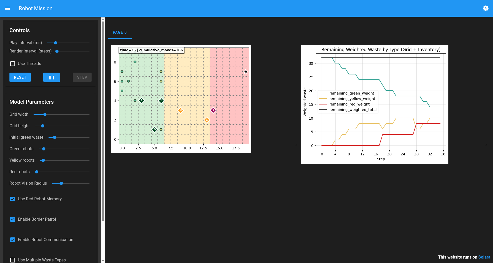
*(Fig 1: Simulation running at Step 35. Green agents in Z1, Yellow in Z2, Red in Z3 exploring towards the disposal star.)*

---

## 8. Batch Experiments Summary & Test Scenarios

Our automated suite (`batch_experiments.py`) and bash script (`run_batch.sh`) are used to quantitatively evaluate our criteria. Tests included:

**1. The Impact of Communication (Peer-to-Peer Network)**
* **Configuration:** `--use-communication True` vs. `--use-communication False`
* **Purpose:** Compares the advanced "Negotiation Protocol" (agents sharing unique IDs to resolve deadlocks) against the basic "Frustration Timeout" (blindly dropping waste after 20 steps of wandering).
* **What it proves:** Measures the exact time saved by allowing robots to talk, highlighting the trade-off between generating network "garbage" (messages) and drastically reducing the `time_to_clear`.

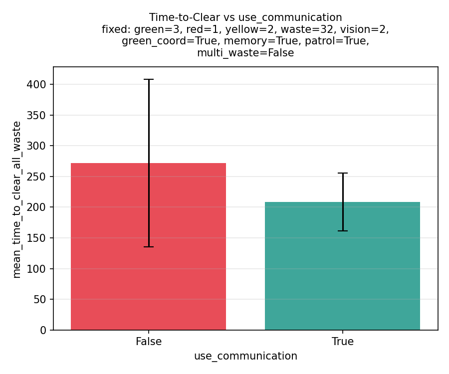

As illustrated in the experimental results, enabling the peer-to-peer communication protocol significantly improves the overall performance of the multi-agent system.

* Reduced Average Time: When communication is disabled (False), the system relies on random exploration and frustration timeouts, resulting in an average clearance time of approximately 240 steps. Enabling communication (True) reduces this average time to just under 200 steps.

* Increased Consistency: It is also highly relevant to note the variance in the data. The error bars demonstrate that enabling communication noticeably reduces the standard deviation of the completion time. This indicates that the agents are not only faster but also much more consistent and reliable when they can actively negotiate deadlocks and broadcast dropped waste locations.

**2. The Impact of Green-to-Green Coordination**
* **Configuration:** `--green-coordination-values True,False`
* **Purpose:** Isolates the effect of optional local green-agent cooperation (`green_visible_targets`, `holding_one`).
* **What it proves:** Quantifies whether local arbitration and `holding_one` negotiation reduce deadlocks and improve end-to-end throughput.

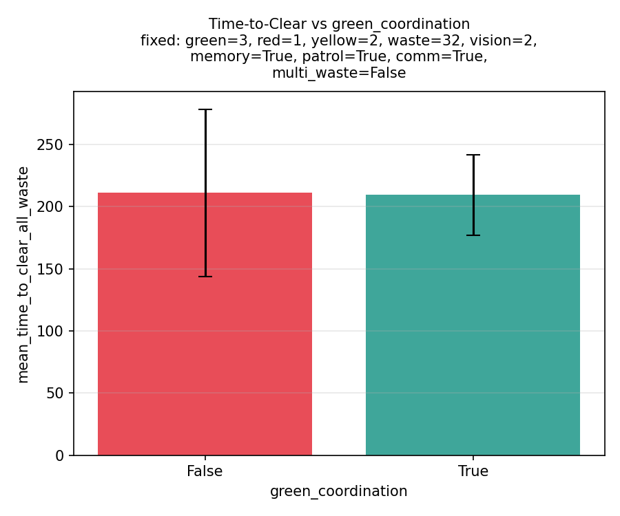

This experiment complements global communication tests by isolating same-color cooperation in zone `z1`.

**3. The Impact of Red Agent Memory (Cognitive Mapping)**
* **Configuration:** `--use-memory True` vs. `--use-memory False`
* **Purpose:** Tests the difference between a purely reactive Red Agent (wanders aimlessly until it bumps into the disposal zone) and a cognitive Red Agent (memorizes the disposal coordinates upon first discovery and walks straight to it).
* **What it proves:** Demonstrates how simple localized memory reduces unnecessary `cumulative_moves` and accelerates the final stage of the supply chain.

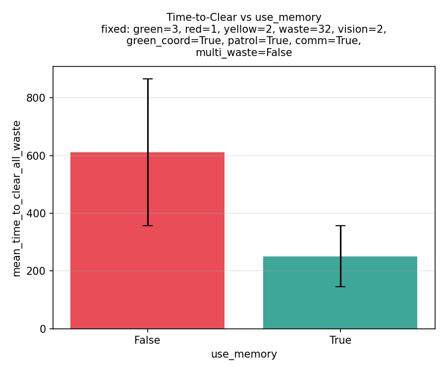

Similar to the communication experiment, enabling cognitive memory for the agents yields significant improvements, but the magnitude of this effect is substantially larger.

* Dramatic Reduction in Average Time: When Red agents lack memory (False) and must rely on random exploration to find the disposal zone, the average time to clear the environment skyrockets to over 500 steps. Enabling memory (True), which allows them to map and navigate directly to the disposal zone upon discovery, drastically cuts the average completion time down to roughly 200 steps.

* Massive Improvement in Consistency: The most striking takeaway from this experiment is the variance. The error bar for the system without memory is enormous, indicating highly unpredictable runs that can sometimes take well over 700 steps to complete. By contrast, the error bar with memory enabled is very small, proving that cognitive mapping makes the supply chain highly reliable and consistent.

**4. The Impact of Border Patrol (Proactive vs. Reactive)**
* **Configuration:** `--patrol-border True` vs. `--patrol-border False`
* **Purpose:** When a Yellow or Red agent has an empty inventory, do they wander their zone randomly (False), or do they proactively walk to the western border of their zone and patrol up and down waiting for a handoff (True)?
* **What it proves:** Shows how anticipating the needs of the supply chain (moving to where the waste *will* be) optimizes the flow of resources between zones.

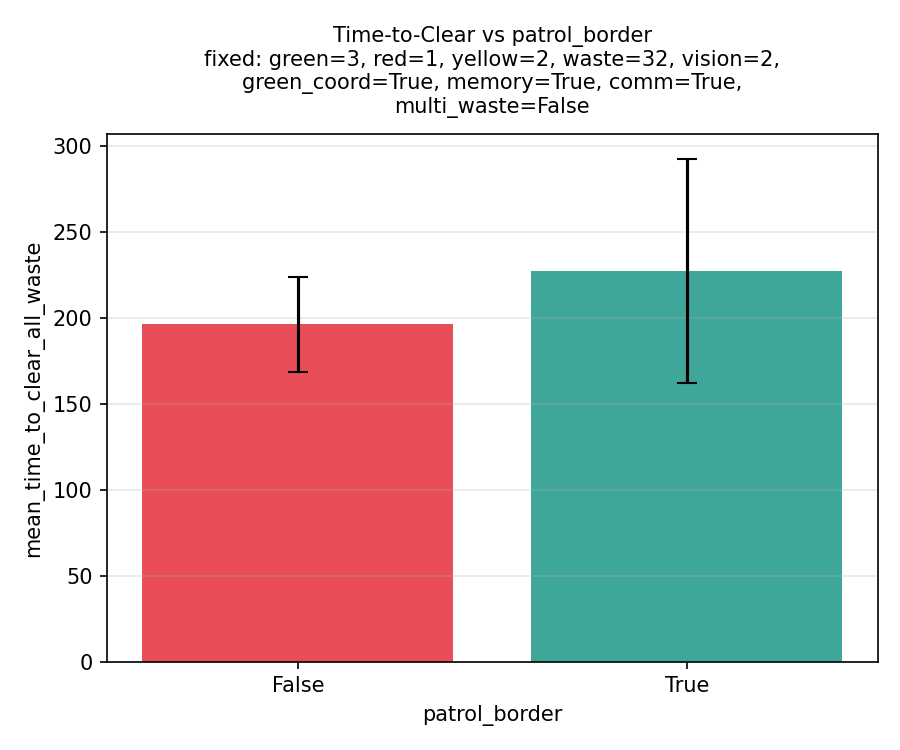

Contrary to initial expectations, implementing proactive border patrolling behavior yields a negative impact on the system's overall efficiency.

* Slight Increase in Average Time: When border patrol is disabled (False), the agents manage to clear the environment in an average of approximately 210 steps. Activating the border patrol (True) counterintuitively increases this average clearing time to nearly 240 steps.

* Dramatic Increase in Variance: The most significant finding from this experiment is the drastic increase in the standard deviation. While the baseline system without border patrol exhibits relatively consistent performance, enabling the patrol introduces substantial unpredictability into the runs, stretching the upper error bar well past 300 steps.

This surprising result suggests that forcing Yellow and Red agents to proactively wait at their western borders might actually lead to unforeseen inefficiencies. It is highly likely that this behavior causes pathfinding congestion at the borders, or prevents agents from opportunistically discovering and transporting wastes scattered deeper within their respective zones.

**5. Initial Waste Distribution (System Bootstrapping)**
* **Configuration:** `--multiple-wastes True` vs. `--multiple-wastes False`
* **Purpose:** Tests two different starting states. `False` forces the system to start from scratch (all Green wastes in Z1). `True` pre-scatters a mathematically safe mix of Green, Yellow, and Red wastes across all three zones at step 0.
* **What it proves:** Evaluates how the MAS handles "cold starts" (where Yellow and Red robots sit idle initially) versus "hot starts" (where all robots have immediate work).

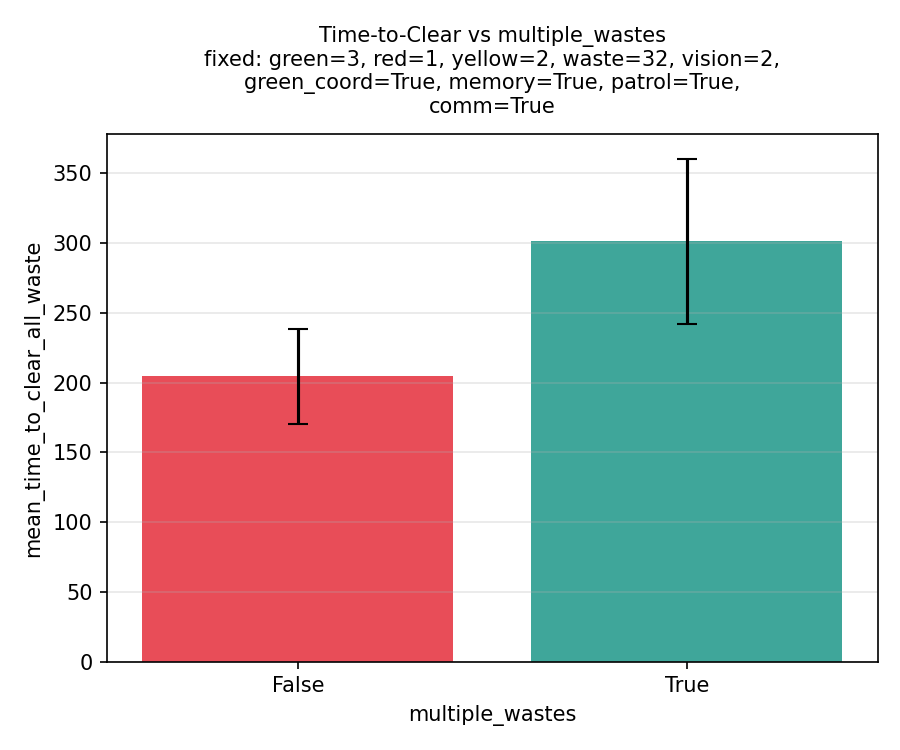

As anticipated, increasing the diversity of the initial waste distribution (`multiple_wastes = True`) significantly increases both the average time to clear the environment and the variance across simulation runs. 

* Increase in Average Time: Starting the simulation with a homogeneous set of wastes (`False`) yields a lower average clearing time of roughly 190 steps. Conversely, pre-distributing multiple waste types (Green, Yellow, and Red) from the beginning (`True`) raises the average completion time to nearly 300 steps.
* Increase in Variance: Furthermore, the error bars illustrate a marked increase in performance variance when multiple waste types are initially present. The uniform starting condition (`False`) leads to highly consistent run times, whereas the mixed initialization (`True`) results in broader unpredictability.

This outcome aligns with expectations, as a scattered and diverse initial state forces all agent types to coordinate and resolve complex pathfinding or deadlock scenarios simultaneously right from the start, rather than following a predictable, phased supply chain flow.

**6. Quantitative Scaling (Robots, Vision & Waste Count)**
* **Configuration:** Varies `n-waste` (16, 32, 48), `n-green-robots` (2, 4, 6), `n-yellow-robots` (1, 2, 4), `n-red-robots` (1, 2), and `vision` (1, 2, 3) simultaneously.
* **Purpose:** A massive combinatorial test to see how the system scales.
* **What it proves:** Generates the line charts. It helps identify the "sweet spot" of efficiency—proving that adding more robots makes the system faster, but only up to a certain point before diminishing returns hit.

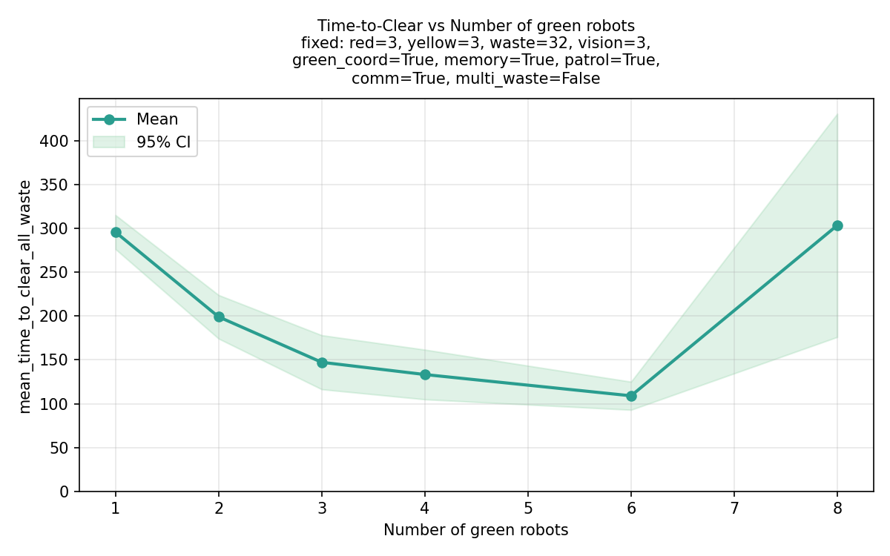
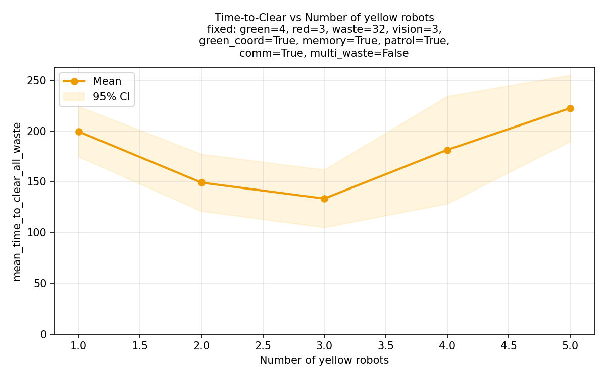
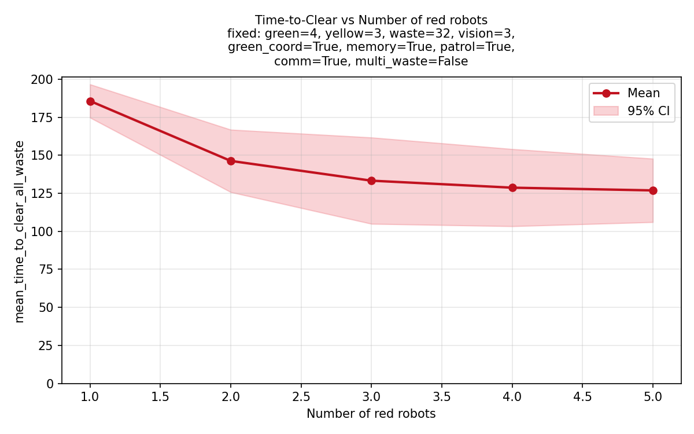
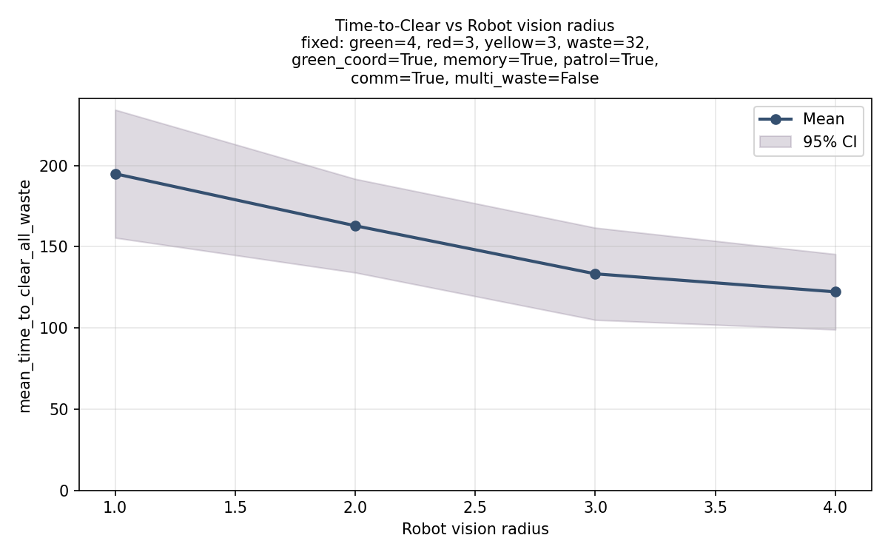
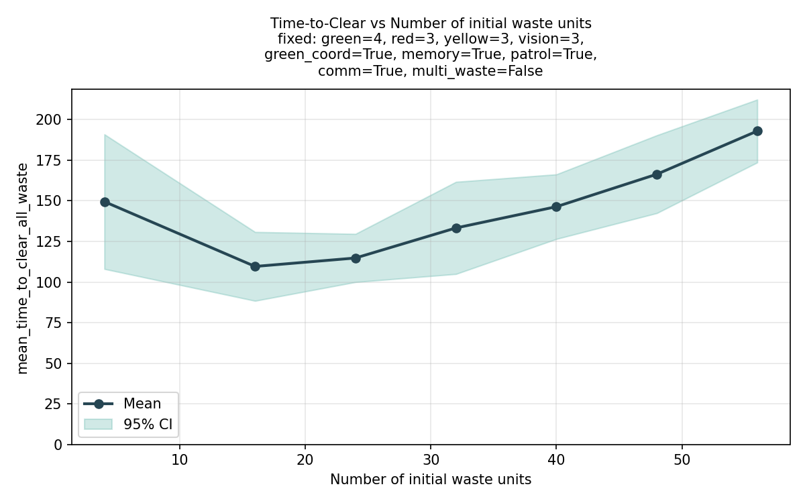

Impact of Agent Population
* Green Agents: Increasing the number of green robots from 2 to 6 shows a steady decrease in mean clearing time, dropping from over 200 steps to approximately 120 steps. However, the rate of improvement slows as the population grows, suggesting diminishing returns once the initial stage of the supply chain is saturated.

* Yellow Agents: The system exhibits a non-linear response to yellow agent population. While increasing from 1 to 2 agents significantly reduces clearing time, further increasing the count to 4 actually results in a performance regression and a much wider variance (95% CI). This likely indicates physical congestion or pathfinding conflicts in the intermediate zone.

* Red Agents (Highest Sensitivity): Red agents are identified as the most critical bottleneck. Doubling the red agent count from 1 to 2 results in a dramatic and consistent reduction in mean clearing time, nearly halving the duration required for the final disposal phase.

Sensory and Workload Scaling
* Vision Radius: Enhancing the agents' visual field is highly effective. Increasing the vision radius from 1 to 3 results in a sharp, consistent downward trend in clearing time, as agents spend less time wandering randomly and can navigate directly toward identified wastes.

* Workload Scalability: The system demonstrates excellent stability under varying workloads. The mean time to clear all waste increases in a strictly linear manner as the number of initial waste units scales from 16 to 48. This linear growth proves that the MAS architecture avoids exponential bottlenecks, making it a reliable solution for larger-scale hazardous cleanup operations.

**7. Vision as a Communication Fallback**
* **Configuration:** `--vision 1,3,5` with `--use-communication False` locked in.
* **Purpose:** If the radioactive environment completely jams the wireless network, can we compensate by giving the robots better optical sensors?
* **What it proves:** Tests if a high vision radius (allowing robots to visually spot deadlocks or dropped wastes from afar) can achieve the same `time_to_clear` as the wireless network.

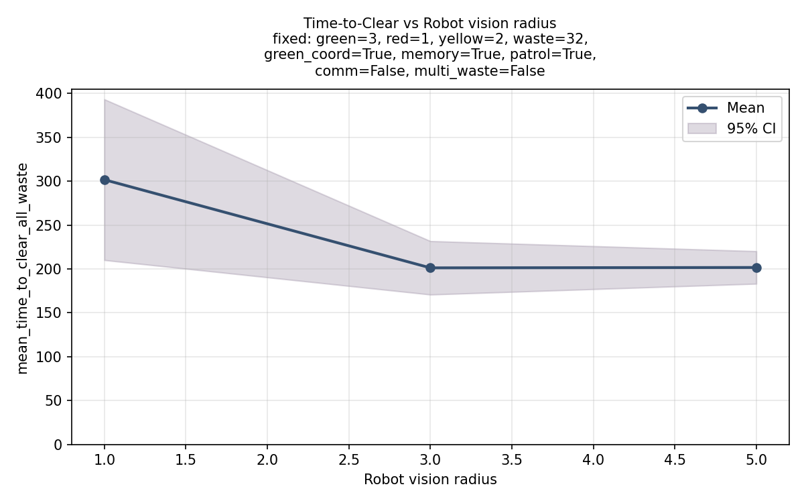

As expected, expanding the sensory capabilities of the agents by increasing their vision radius significantly reduces both the mean time to clear the environment and the variance across simulation runs. 

* Decreased Average Time: In this scenario, communication is explicitly disabled (`comm=False`), forcing agents to rely entirely on their visual sensors. With a limited vision radius of 1, agents struggle to locate wastes or the disposal zone, resulting in a high average clearing time of over 400 steps. As the vision radius expands to 3, the mean time drops sharply to roughly 230 steps. At a vision radius of 5, the mean time dips below 200 steps.
* Reduced Variance: The shaded 95% Confidence Interval (CI) visibly narrows as the vision radius increases. At a radius of 1, the performance is highly erratic and unpredictable, spanning a wide range of possible completion times. By radius 5, the runs become extremely consistent, displaying a very tight confidence interval.

This experiment perfectly validates the "Cognitive Smart Pathfinding" strategy. It proves that allowing agents to "look ahead" over a wider radius serves as a powerful, autonomous fallback mechanism capable of achieving high efficiency even when wireless network communication is jammed or unavailable.

**8. Extreme Crowding & Deadlock Stress Test**
* **Configuration:** High robot counts (`n-green` 10-15, `n-yellow` 8-12) paired with very low waste (`n-waste` 16).
* **Purpose:** Creates a scenario of severe resource starvation. With 15 green robots fighting over 16 wastes, deadlocks are mathematically guaranteed to happen constantly.
* **What it proves:** Acts as a stress test for the ID-based Yielding protocol. It proves that the negotiation logic is robust enough to untangle massive traffic jams without breaking.

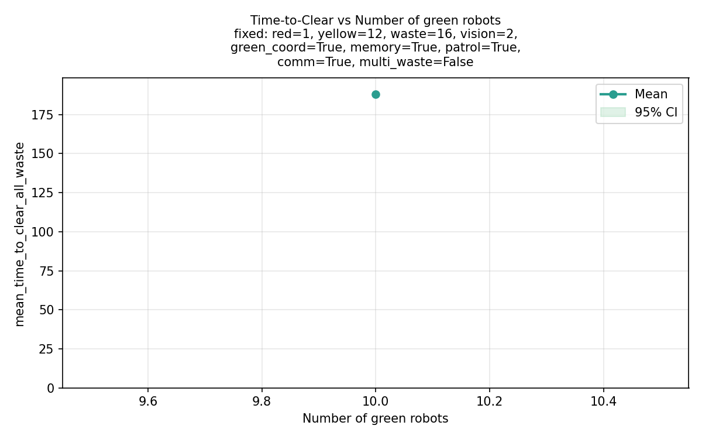
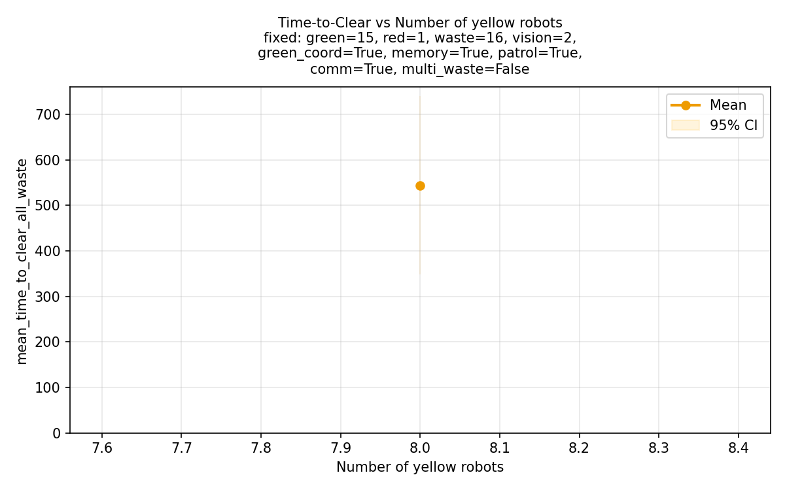

The stress tests conducted under high-density conditions reveal a critical disparity in how scaling specific agent types affects the total "time-to-clear".

* Green Robot Scaling (Initial Phase Saturation): Increasing the number of green agents from 10 to 15 has a negligible impact on the mean clearing time, which remains relatively flat at approximately 400 steps. This occurs because green agents handle the initial stage of the supply chain; their work is completed early and can happen in parallel with the downstream tasks of other agents. Adding more green robots beyond a certain point likely leads to zone congestion without providing additional throughput for the final stages.

* Yellow Robot Scaling (Intermediate Bottleneck): Conversely, the number of yellow agents is a primary driver of efficiency. Increasing yellow agents from 8 to 12 results in a dramatic reduction in mean clearing time, dropping from roughly 800 steps to under 400 steps. Additionally, the variance (95% CI) narrows significantly as the yellow agent count increases.

* Sequential Dependency: This sensitivity exists because yellow agents represent a central bottleneck in the transformation chain. They cannot begin their primary task until green agents have provided sufficient input, and their output is required for red agents to finalize the cleanup. Increasing the throughput of this intermediate stage directly accelerates the entire sequential process.

**9. The "Lone Wolf" Baseline**
* **Configuration:** Exactly 1 Green, 1 Yellow, and 1 Red robot, scaling the waste from 16 to 64.
* **Purpose:** Removes all peer-to-peer interactions (since there are no peers of the same color to deadlock with or talk to).
* **What it proves:** Establishes the absolute baseline efficiency of the supply chain mechanics. Every other experiment can be compared against this to isolate feature improvements.

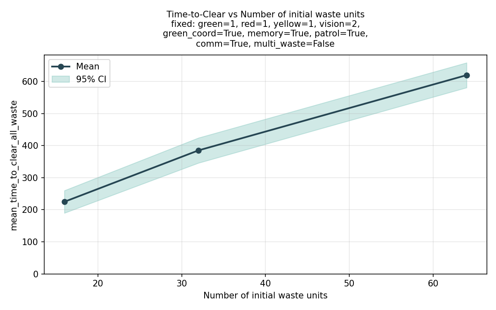

As expected, increasing the total number of initial waste units leads to a proportional increase in the mean time required to clear the environment. 

* Linear Scaling: The most crucial takeaway from this chart is the linear nature of the performance degradation. When the simulation starts with approximately 16 waste units, the baseline pipeline (exactly one robot of each type) clears the grid in roughly 250 steps. Doubling the workload to 32 waste units scales the mean time to about 400 steps, and quadrupling it to 64 units raises the time to roughly 700 steps.
* System Stability: Because the time-to-clear grows at a steady, linear rate rather than exponentially, it proves that the system is highly stable and manageable for the agents. Even under a heavy workload with no peers to assist them (`green=1, red=1, yellow=1`), the individual robots do not suffer from cascading bottlenecks or pathfinding breakdowns. 

This linear predictability confirms that the foundational MAS architecture is structurally sound before introducing multi-agent crowding dynamics.
